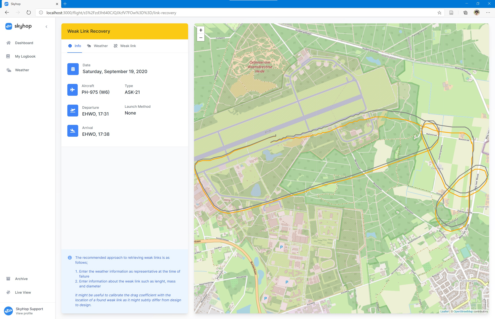

In todays second update I have made weak link recovery more widely accessible! Though it has been a longtime feature, it was only barely accessible, and tucked away in some obscure corner. Today I'm correcting that! I'm sincerely hoping this tool will save everybody boatloads of time recovering their links!

## What does it offer?

As a weak link is also just some physical material, it's possible to calculate it's track. As the aircraft's location at the time of failure is known, it is therefore possible to calculate where the weak link would hit the ground in an idealized situation.

The tool shipped today makes that possible by allowing you to enter information about the weather conditions, as well as properties about the weak link. It'll combine this information with the flight path in order to calculate a place where this weak link might have fallen. The path where the link may have fallen is subsequently shown on the map.

## Notes on it's usage

This tool only makes an estimate where the weak link may have fallen. Of course we do not know when it has been disconnected so that is one thing to consider when looking for a link. Additionally, we've assumed the weak link has a cylindrical shape, and therefore we're using the radius as a property to calculate the drag on this link while falling. Any irregularities can be embedded within the drag coefficient.

Personally I would recommend on producing consistent weak links with regard to mass and length, and then to experiment a bit with the drag coefficient until a number has been found which consistently works well.

Additionally it would be possible to calibrate the drag coefficient by using a failed weak link, setting the correct weather conditions and weak link properties, and then tweaking the drag coefficient until the estimated path overlays the actual location of the weak link.

## What's next?

First of all, I hope this tool, in it's current form will already help solve a lot of time when you need to recover your weak links.

Currently the properties entered in this tool will not be stored, so if you converge on an usable value to use for the drag coefficient, I recommend you note it down somewhere. In the future I'm looking to provide a feature in which feedback can be given about the location of the weak link, such that Skyhop is able to automatically calculate the drag coefficient for your weak links, and making estimations more accurate over time.

Additionally, I'll be looking for options to automatically collect the weather situation for a given launch, and use that as a starting point.

I'm hoping you find this useful, and please direct any feedback to [corstian@skyhop.org](mailto:corstian@skyhop.org).

Thanks!  
\- Corstian