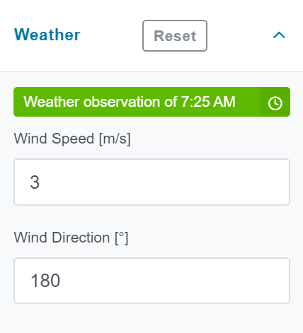
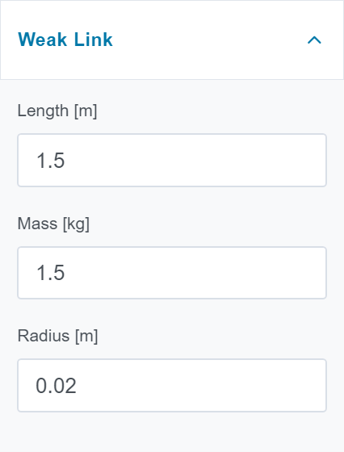

# Weak link recovery

Whenever a weak link breaks, be it during a winch launch or during an aerotow, it can be quite a hassle to recover it, if possible at all.

In order to facilitate and speed up weak-link recovery we have built a tool to help out in this scenario. This tool uses the available flight and weather information to make a well educated guess about the possible location of a weak link. Although this is only an estimation, it can help reducing the search area and applying an effective search strategy.

You can access this functionality via the flight archive, by clicking the more button, or via the control center in the more menu for a flight.

## Parameters
There is a simple selection of properties you can change in order to influence the calculation on where the weak link might possibly have landed.

### Weather
Whenever possible, the latest METAR is being retrieved from the closest station available. You can manually change the wind speed or direction in order to match the local conditions as closely as possible.

### Weak link
Weak links differ from airfield to airfield, and highly influence the possible location of a weak link. Changing these properties will influence the estimate of a weak links location.

### Drag coefficient
The drag coefficient is an estimation of all unknown variables related to aerodynamics. A value of 1.1 mostly works correctly for a long cylinder.

This value might be different based on what type of weak link is being used. Having a banner for example would result in different aerodynamic properties than just having a weak link.

In order to improve accuracy of the estimation algorithm it's possible to report the locations of recovered weak links via the Skyhop Telegram bot.