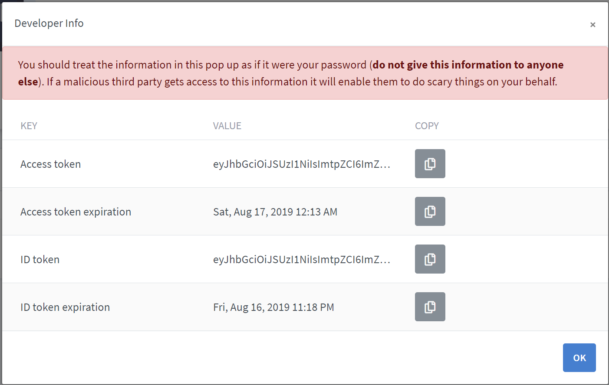

# GraphQL API

The graph API is one of the core components of the skyhop platform. Via this API it's possible to invoke all functionality which we have implemented in the web application ourselves.

If you are not yet familiar with GraphQL, please consider checking out the documentation over at [https://graphql.org](https://graphql.org).

For your convenience there's an instance of GraphQL Voyager running over at [https://api.skyhop.org/graph/voyager](https://api.skyhop.org/graph/voyager). With GraphQL Voyager you can see the whole layout of the graph API in an UML like diagram.

## Getting authenticated
In order to be able to use the graph API you will need to retrieve an authentication token. This token tells the API who your are (or who you represent), and retrieves to correct data for you. You can get an authorization token in one of several ways:

1. Grab one from the developer tools in the Skyhop application. You can open a hidden modal by typing the so called 'konami code' ( ↑ ↑ ↓ ↓ ← → ← → B A ). Please note these access tokens are only short lived, and you might need to retrieve a new one every hour. This function, however, is accessible to both free and paid subscribers.

2. Register your application for an access token on your behalf. These long-lived access tokens grant your application continuous access to the graph API. Please note that this is only available on paid subscription plans.

3. Register your application for an appropriate OAuth authorization flow. This way users are redirected to Skyhop where they grant your application access to their data. This is available by default on group or airfield subscriptions. If you're not on one of those subscription plans, please contact skyhop support for more options.

## Using voyager
Voyager is a tool which maps out a GraphQL schema in an UML like diagram. By using Voyager it gets easier to discover ways to navigate through a graph schema.
